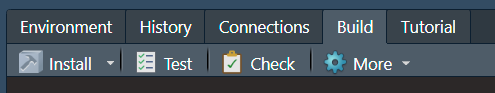

# - Creation of the package structure

## Initiation the global architecture

Now you have an working environment correctly configured and we have taken a few moment to thing about our package aim. We can go deeper and initiate the structure of our new package from an active R session. You don't have to take care about the configuration of your local session because the function associated will be create a clean new project for your package. First, load the [devtools](https://devtools.r-lib.org/){.external target="_blank"} and by association is friend [usethis](https://usethis.r-lib.org/){.external target="_blank"}.

```{r}
#| label: load-devtools-and-usethis
#| echo: true
library(devtools)
```

Just to be sure that you have everything you need to develop R package you can launch the following command line to display a report of the package development situation.

```{r}
#| label: package-development-situation
#| echo: true
dev_sitrep()
```

If everything rock's, launch the next command to initiate the global architecture of your package. For the training, my new R package will have the acronym "macfly" for "My Anwesone paCkage For Learning with Yearning".

```{r}
#| label: create-package-fake
#| eval: false
#| include: true
create_package(path = "~/macfly")
```

```{r}
#| label: create-package
#| echo: false
library(dplyr)
create_package(path = path.expand("~/macfly"))
knitr::opts_knit$set(root.dir = "~/macfly")
```

Another solution with RStudio is to use the interface through the *file* menu, *New Project...*, *New Directory*, *R Package*, file the field "Package name:", click on "Open in new session" and finish with \*Create Project". Even is the approach is similar, the click-button interface create in addition a template function with a proposal for the documentation associated. In opposite, the command line creation include by default a .gitignore file (for Git use). It's not true important but it could be a bit better to use the command line because we will learn how to create a R function template later and in your developer life it could be very rare (and dangerous) when you don't use a Git associated to your work.

By default, RStudio open a fresh session associated to the R environment of your package and you should need to call again `library(devtools)`.

::: callout-note
For your information, you will find in the [usethis](https://usethis.r-lib.org/index.html){.external target="_blank"} package a function [`create_tidy_package()`](https://usethis.r-lib.org/reference/tidyverse.html){.external target="_blank"} that extends `create_package()` by applying many of the tidyverse development conventions as possible. I don't recommend using that way, instead of you know exactly what you do and to save time in the future, because it's better to really understand each step of the package creation.
:::

::: callout-important
At least, you could see sometime a function call `package.skeleton` from the [utils](https://www.rdocumentation.org/packages/utils/versions/3.6.2/topics/package.skeleton){.external target="_blank"} R package. Even if this function create a package structure it's an "old way" to do and you should have some trouble if you use it, especially with you want to use the tidyverse philosophy.
:::

## Overview of the package strucutre

If you follow the previous step, you should have the opening of a new RStudio session and the creation of a new directory on your local drive called just like your package name. Let take a moment that.

### The package directory

Inside the package directory, you should see 8 elements (the `.Rhistory` file is normally generated when you close for the first time in your RStudio session, but his generation depends on your personal configuration).

::: callout-note
If you show a number or kinds of elements different than below without change anything in the command line below, maybe it's because you don't have to unlock the hidden files. In order to remedy you can go in the setting directory option (normaly and can access to that directely in any directory on Windows) and in the parameters apply the visiblity of hidden elements. In RStudio to see hidden files in the *files* panel, go to *More* (gear symbol) the tick *Show Hidden Files*.

In addition, if highly recommend displaying file extension in your file explorer (on Windows, it's normally near the option for hidden elements). By default this display is hidden and could be a little bit strange when you activated it, but it's very important to sensitize the user of what kind of file you will open. Furthermore, be aware the "clothes don't make the man" and the extension is only a shortcut for the system to know how to deal with that but don't make any guarantee of what you have inside. In accordance with rules of good practice (especially link to the security), take a moment to think about what you're about to open and display the extension is a good first step to begging.
:::

```{r}
#| label: directory-files
#| echo: false
fs::dir_info(all = TRUE) %>%
  dplyr::select(path,
                type) %>%
  dplyr::rename("Element name" = path,
                Type = type) %>%
  knitr::kable()
```

-   *.gitignore*, we will see in the next step (put here section id) how to connect our local package directory to a git. This file indicates which files or directories have to be ignored for the git commits.
-   *.Rbuildignore*, in the same way that the *.gitignore*, this file indicate which elements have to be excluded during the package compilation.
- *.Rhistory*, by default this file keeps tracks of every command you've typed into the R console. When you close R, it often saves this file automatically. Be aware of that process, because this file may contain sensitive data (access to local files, credentials, etc.). You will see later that when we make connection with Git, we will ignore this file through the *.gitignore* file. If you don't want to generate and keep this file, in RStudio *Global Options*, section *General* you can disable "Always save history (even when not saving .RData)".
-   *.Rproj.user*, this directory is normaly hidden and used internally by RStudio.
-   *DESCRIPTION*, this is an important file that provides metadata about your package, like the authors, the package description and the dependencies.
-   *macfly.Rproj*, this file, dedicate to RStudio, aims to organize your work through define the working directory of your project, memorize parameters specifics and able to open directly the project in RStudio by double click on it.
-   *NAMESPACE*, this file aims to declares functions "used" among your package (through external and internal ways).
-   *R*, this directory will contains all the functions developed in your package.

## RStudio package environment

If you take a look at the panel *Build* in the Rstudio environment you should see several new sections, like *Install* or *Check* (<a href="#figure1">figure 1</a>). We will take a look after in each of one, but keep in our mind that this sections is a shorcut way to apply processes on your package.

<figure id="figure1">



<figcaption class="figcaption-center">

Figure 1: RStudio Build panel

</figcaption>

</figure>

::: callout-note
In preparation for the documentation generation, the only thing to do now is to go to the *Configure Build Tools* options (click on *More* (gear symbol) and *Configure Build Tools*). In the *Project Options* menu, *Build Tools* section, click on the *Configure* button near *Generate document with Roxygen*. In the new windows, fill all the proposals. This process will create and update documentation automatically when you launch several packages processes. Sometimes, it may justify not filled all is if you have a really huge documentation or a specific rule for documentation generations.
:::
