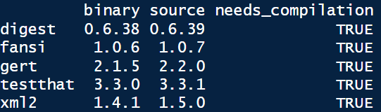
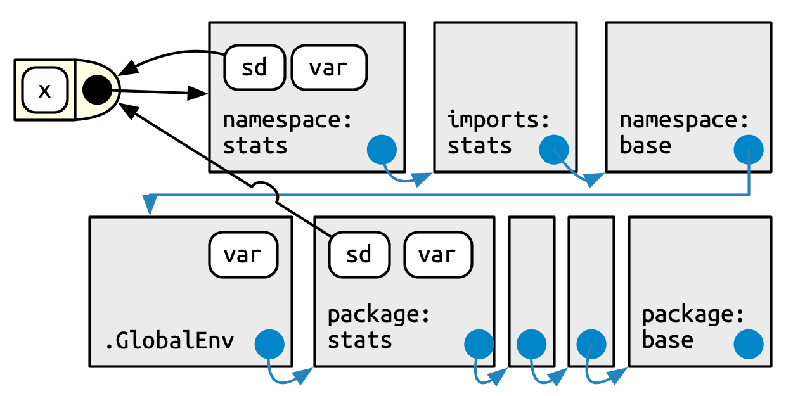

# - Dependencies {#sec-dependencies}

Dependencies and deal with them in your package is one of the most steps in your package development and in fact his lifecycle. We will see that adding a dependency could bring a lot of advantages for your processes, but come also with a portion of risk, to summarize [**"great power come with great responsibilities"**]{style="color:#ca0030;"} and you have to define if ["**I do it if it's worth it !**"]{style="color:#ca0030;"}.

At first sight, use a maximum of dependencies could be a great idea because that mind use something already created, tested and used by others and you don't reinvent something which already exists. But introduce dependencies in your code could also have strong consequences. For example, if dependencies change and evolve over time, you maybe need to change your code and increase the maintenance associated (don't underestimate this phase because it's a lot of time consuming in your package life, especial if your package is used and share by a lot of people). In addition, add dependencies could increase the time and disk space needed when users install your package and if you have a little experience in dependency management in R you will know that topic could bring several errors during updating or installing process (in addition to the variability of each OS and user working environment).

However never use any dependency is not a good idea because even if you don't have any problem, you leave behind a lot of great potential functionalities and at the end you could increase the time of maintenance (take a look at packages which provide a process of continuous integration) and be sensitive to new bugs because you don't use the power of reflection of the global R community (you will get the benefit of all the bugs that have already been discovered and fixed).

## - Global guideline

Like always, there is not one perfect way but a [**good compromise**]{style="color:#ca0030;"} between no dependency and the hell of too many dependencies and the goal is to find your way according to your needs. To support you in the search to find the right choice for you, you will find below several advises:

-   [**First one**]{style="color:#ca0030;"}, to take into account that all the dependencies don't have the same level of consequences if you put them into your package structure (a balance between costs and benefits). For example you should have heard about the [base](https://search.r-project.org/R/refmans/base/html/base-package.html){.external target="_blank"} or the [stats](https://search.r-project.org/R/refmans/stats/html/stats-package.html){.external target="_blank"} packages. Theses kind of packages come bundled with R itself and they are very low cost of depend on because they are nearly universally installed on all users' systems and were updated with new R versions. In opposition, if you want to add in dependencies a package from a Git repository, you should have a lot of consequences in term of maintenance and of deployment of your package to users (also associated to the potential instability to the package). Just to explain more that, you will find today a lot of packages hosted on the CRAN repository in a stable version with a development version of packages associated available on a Git (often GitHub). To be available on CRAN repository, a package must follow several rules and in particular be compatible with the all existing R environment, included packages already available on CRAN. To simplify, take a package from CRAN guarantee to have a stable version, which is not the case all the time when you deal with package hosted on a Git. Generally we take package from a Git when we want a specific function or feature, not included yet in the stable version of the package. To come back to the topic of type of dependencies, take a dependency package from CRAN will come with less of consequences that a package take from a Git (or similar) repository.

::: callout-note
When you update your packages in R you should have a popup menu with the question "Do you want to install from sources packages which needs compilation" with in addtion in the R console something like the image below.

<figure id="figure1">



</figure>

It's important to understand that if you answer yes to this question, you will install package (not in [binary state](https://umr-marbec.github.io/r_packages_development_training/pages/06_package_states.html#binary-package){.external target="_blank"}) from another repository than the one defined as your package repository (like the CRAN or [Bioconductor](https://www.bioconductor.org/){.external target="_blank"}). That means that you will install the last version of the package available (in the image source version is updated compares the binary one) but maybe not the last stable version. Like we told before, if you don't need a specific feature prefer install always package from an "official" package repository.
:::

-   The [**second**]{style="color:#ca0030;"} advice is to be careful about the recursive dependencies and the associated installation in series. For example, you can find on CRAN package with a lot of recursive dependencies and that means that these dependencies should be installed in addition to the initial package dependency. A good thing about that is that you could have some dependencies already fulfilled. For example, if your package has a [dplyr](https://dplyr.tidyverse.org/){.external target="_blank"} dependency, adding [tibble](https://tibble.tidyverse.org/){.external target="_blank"} dependency does not change the dependency footprint because dplyr already depends of tibble (it's a recursive dependency). To go deeper, use packages structured in a larger community (again the case of the tidyverse packages), simplify your code because these packages could share the same behaviors regarding processes are in addition could by associated between them. In the same aspect, popular packages were probably already installed on the majority of users' machines and adding theses in dependencies should be lower in terms of consequences.

::: callout-note
Two functions of the [pak](https://pak.r-lib.org/){.external target="_blank"} package could help you to explore dependencies relations, [`pkg_deps_tree()`](https://pak.r-lib.org/reference/pkg_deps_tree.html){.external target="_blank"} and [`pkg_deps_explain()`](https://pak.r-lib.org/reference/pkg_deps_explain.html){.external target="_blank"}. Below you have an example for the dependency tree of the [usethis](https://usethis.r-lib.org/){.external target="_blank"} package and the explication of the link between `usethis` and `cli` package. By default, functions give you the mandatory dependencies (we will explain that after) but you can play with the argument `dependencies = TRUE` to see all the dependencies associated (mandatory and optional) and begging to understand the "hell".

```{r}
#| label: dependency-tree
#| echo: true
library(pak)
pkg_deps_tree(pkg = "usethis")
pkg_deps_explain(pkg = "usethis",
                 deps = "cli")
```
:::

-   [**Third**]{style="color:#ca0030;"} point to be aware is the suffering and the pain of installing the package. This could be associated with the time to compile it (link for example to the complexity of the code contain), the size of the package and the worst one, the system requirements. The best example to illustrate that is the [rJava](https://rforge.net/rJava/){.external target="_blank"} package. If you have dealt with access database connection through R, you should already use it and have some troubles related to the installation and configuration of the Java SDK on your machine (especially if the user doesn't have the admin rule on his computer). So the best advice that I can get is if you can replace or not use this kind of package, do it!

-   As [**fourth**]{style="color:#ca0030;"} guideline find information about maintenance capacity of the package and globally about the communities associated. Tidyverse packages are a good example of that because you will a very large communities around them, a higher confidence associated and maintained by developers. As example, a non maintained of a dependency in your package should oblige you to modify your processes and request more maintainer from yourself.

-   The [**last one**]{style="color:#ca0030;"} is to ask yourself if you really need to use function(s) of a package to do what you want. Sometime, we just need only one function of a big thing and if we take a moment to step back maybe it's simpler to write something on your own and avoid all the "complexity" of associated a new dependence in your package. In addition, ask yourself about the potential users of your package could help: an expert on our domain should have already the same kind of packages that you asking through dependencies.

## - Dependencies declarations

### - Field in the `DESCRIPTION` file

In the [section 7.7](https://umr-marbec.github.io/r_packages_development_training/pages/07_DESCRIPTION_file.html#futures-fields){.external target="_blank"} we discussed future fields. There are two major field used for declare packages dependencies, `Imports` and `Suggests`.

[**`Imports`**]{style="color:#ca0030;"} listed packages mandatory for your package work. Any time your package is installed, those packages will also be installed, if not already present.

[**`Suggests`**]{style="color:#ca0030;"} if for packages not necessary to your package work, but could be use in several particular case. It might be packages for run tests, build vignettes or development processes. In fact that mean that the regular user never use theses packages, so it's necessary to install them only if you need to.

You can find others fields for dependencies like `Depends` (used for example to define a minimum R version), `LinkingTo` (used if your package uses C or C++ code from another package) or `Enhances` but it's very specifics and you should probably never use them.

We will go deeper into that later when we define some dependencies for our package but keep in your mind that you will find at the place all the packages dependencies used in your package with some potential additional information (like the minimum version mandatory).

### - The `NAMESPACE` file

The `NAMESPACE` file is one of the other elements created initially in the package directory. Like the name suggest, information in this file provides a location (or a space) to looking up and find an element (like a function). To summaries the aim behind that process, the idea is to [**avoid any kind of confusion or mistake**]{style="color:#ca0030;"} related to the element that you want to manipulate. You should probably already use the concept of the `::` operator, which disambiguate functions with the same name. We will explain that deeper in the next section related to the search path but when I say `dplyr::filter` I say to R that I want to use the `filter` function of the package `dplyr`. The `NAMESPACE` file will do exactly the same thing.

The good news is that you don't need to fill this file manually by hand because just like the first line said, this document was "Generated by roxygen2: do not edit by hand". He describe briefly the package [roxygen2](https://roxygen2.r-lib.org/){.external target="_blank"} in the [chapter 2](file:///D:/developpement/quarto/books/r_packages_development_training/_book/pages/02_r_packages_overview.html){.external target="_blank"} but we go back to it during the chapter on documentation.

::: callout-note
If by mistake you make a modification by yourself in the `NAMESPACE` file instead of an automatic implementation, you should have some error with the explication of impossibility to update the file. If it's the case don't panic, just remove the file and it could be created again and updated at the next compilation of your package.
:::

In this file, each line contains a directive which describes an R object and informs if this object is exported from this package to be used elsewhere or imported from another package to be used internally. Without being exhaustive you can find below the most common directives:

-   `export()` for export a function outside the package,
-   `S3method()` for export an S3 method (pseudo object),
-   `importFrom()` for imported selected object form another namespace,
-   `import()` for imported all objects from another package's namespace,
-   `useDynLib()`, less common but for registers routines from a DLL (Dynamic Link Library).

### - Search path

In the section below, we discuss the use of the operator `::` and the importance to leave no uncertainty or interpretation of R regarding the item that you want to use. To understand why it's dangerous, it's important to know how R work to find an element with a name. It's related to the search path. To call a function, R first has to find it. The first place to look is the global environment (the top-level environment created during a R session). If we doesn't find it there, it looks in the search path which is the list of all packages you have attached to your R session. You can display this search path by launch the code `search()` in the R console. Below, you have an example of my search path of my R session when I launch R without anything else.

```{r}
#| label: search-path-initial-setup
#| echo: false
detach(name = "package:pak")
```

```{r}
#| label: search-path-initial
#| echo: true
search()
```

The order here is important because in this search path each element has the next element as its parents and define the searching order. Like talk before, the first place where R locking is the global environment (`.GlobalEnv`), following by several packages, here attached automatically when you launch a R console. The item `Autoloads` is a little bit particular because it's a special environment used only when it's necessary for save memory. The last one of this search path is the [base](https://search.r-project.org/R/refmans/base/html/base-package.html){.external target="_blank"} package cited before. Now, the important aspect is what happen when you attached a new package through the R console (with `library()` as example)? By doing that you modify the search path, and your package will be inserted right after the global environment. Below, I attached the [pak](https://pak.r-lib.org/){.external target="_blank"} package.

```{r}
#| label: search-path-pak
#| echo: true
library(pak)
search()
```

It's a big change because that means that if the package pak and stats contains a function or an element of the same name, if I just call the element in the R console without any other indication of location, R will select the first one he finds, in this example in the package pak. It could be a serious problem if my intention was to use the function in the package stats and by doing that I create incertitude in terms of processing.

::: callout-note
Behind the tricky way of the search path, R provide you several messages to warning you. As an example, if you attached the `dplyr` package in your R session, you should have the message below.

```{r}
#| label: dplyr-attached-message
#| echo: true
library(dplyr)
```

With that message, R warning you that by attaching `dplyr` in the search path, several objects will not be selected first (in the package `stats` and `base`) if you call them in the R console with only their names (because these names were present in the `dplyr` package and "replace" the others present in packages).
:::

::: callout-important
In this section we discuss about packages attached to our R session but it's important to take a moment to develop this term and the subject around that, especially as you are a package developers. In the common R users way we use the function `library()` to "load" package in our R session but in fact when we doing that we attaches package to the search path and theoretically not loading it.

When you [**loading**]{style="color:#ca0030;"} a package, you will load code, data, DLLs (little pieces of codes to simplifying ) and register S3 and S4 methods and by association run the `.onLoad()` function (could be used for side-effects, for example to doing something after package loading). Your package will be available in memory but not in the search path so you won't be able to access its without using `::`. The tricky thing it's that using `::` will also load  package automatically is it isn't already loaded.

In a second hand, when you [**attaching**]{style="color:#ca0030;"} a package, you put it in the search, but you can't attach a package without loading it first, so when you use `library()` you load and attach a package (by association run `.onAttach()` function, which have the same purpose that the `.onLoad()` but when you attach package).

You will find in the <a href="#table1">table 1</a> below a comparative of the four functions that make a package available.

<figcaption id="table1" class="figcaption-center">

Table 1: R functions for load or attach a package.

</figcaption>

| | Return an error | Return `FALSE` |
|----|----|----|
| Load | `loadNamespace("package_name")`<br>Not really used | `requireNamespace("package_name")`<br>Used if you want a specific behaviour depending is the package is installer or not |
| Attach | `library(package_name)`<br>Never use in package code below R/ or tests/, used locally if you want to terminate a script after an error | `require(package_name)`<br>Don't trust the name and dangerous because the process will continue when in case of failure. Maybe useful in case of suggested package (see [section 9.2.1](https://umr-marbec.github.io/r_packages_development_training/pages/09_dependencies.html#field-in-the-description-file){.external target="_blank"}) |
:::

### - Package environment

With all the information above, you should understand the process of R to find objects regarding your needs. But to be very clear we have to talk about the package environment. It's an important aspect because you will see after when we write some code inside our package, that you have to play with this package environment to access of the process that you define in your package.

The best way to deal with that is to take a concrete example from the section [10.3.2](https://r-pkgs.org/dependencies-mindset-background.html#function-lookup-inside-a-package){.external target="_blank"} of the R Packages book. The function `sd()` of the `stats` pacakge use the function `var()`. But, if the user define a new function also call `var()` in the global environment, the function `sd()` will continue to use the function `var()` from the package `stats` and work correctly. This behavior is non consistent with what we expected regarding the search path. It's related to the environments.

Every function in a package is associated with a pair of environments, the package environment and the namespace environment. The package environment is the external interface to the package which exposes only objects exported. Globally, when you use the `::` operators you discuss with the package environment and you use the search path process explain above. The namespace environment is the internal interface of the package and includes all objects in the package (exported or not). That means that every link exists in the package environment also exists in the namespace environment but not to the contrary. This is why the package `stats` use the "correct" function for `var()` in our example above (a summary of the global example process is displayed in the <a href="#figure2">figure 1</a> below).

<figure id="figure2">



<figcaption class="figcaption-center">

Figure 1: Global process for R object finding (copyright @r_packages_hadley_2023)

</figcaption>

</figure>
